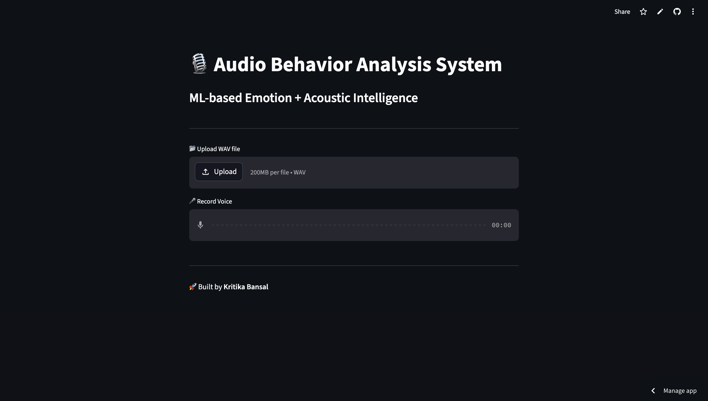
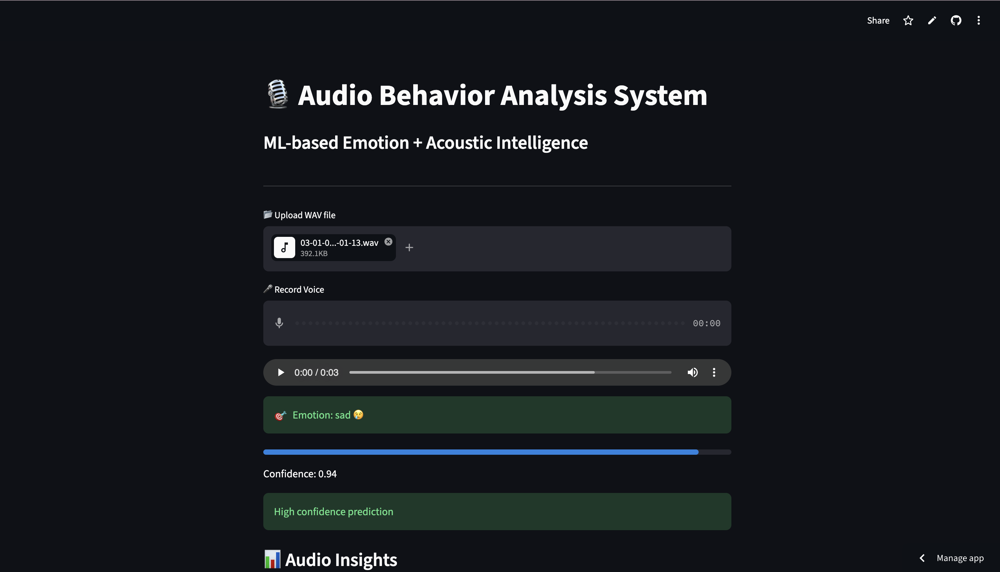
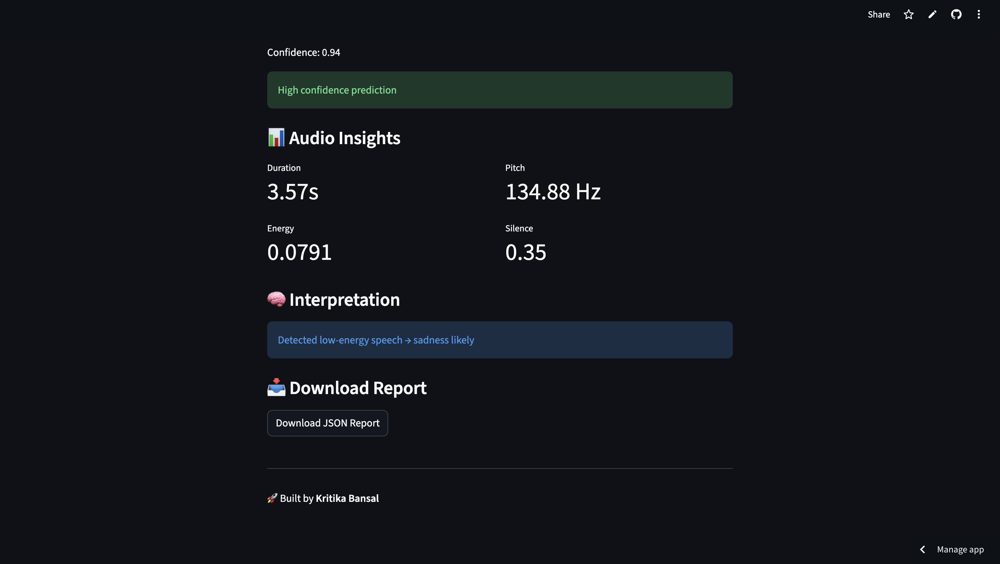

# 🎙️ Acoustic Emotion Analysis using Machine Learning

> 🚀 An intelligent system that understands **how you speak**, not just **what you say**.

---

## 🌐 Live Demo

🚀 Try the deployed application here:
👉 https://acoustic-emotion-analysis-using-machine-learning-3chfypjgt5mxt.streamlit.app/

> No installation required — upload or record audio and get real-time emotion analysis.

---

## 🌟 Overview

This project is a **real-time Audio Behavior Analysis System** that detects human emotions from speech using **Machine Learning and acoustic signal processing**.

Unlike basic models, this system provides **interpretable insights** such as energy, pitch, and silence — helping understand *why* a prediction was made.

---

## 🎯 Features

* 🎯 Emotion Detection: Angry 😠 | Happy 😊 | Sad 😢 | Neutral 😐
* 📊 Confidence Score for predictions
* 📈 Audio Insights:

  * Energy (loudness)
  * Pitch (frequency)
  * Silence Ratio (pauses)
  * Duration
* 🧠 Smart Interpretation of results
* 🎤 Real-time microphone input
* 📂 WAV file upload
* 📥 Downloadable JSON report

---

## 🧠 Tech Stack

* Python
* Streamlit
* Scikit-learn
* Librosa
* NumPy
* XGBoost

---

## 📂 Dataset

This project uses the **RAVDESS (Ryerson Audio-Visual Database of Emotional Speech and Song)** dataset.

* Emotions:

  * Angry 😠
  * Happy 😊
  * Sad 😢
  * Neutral 😐

* 24 professional actors

* High-quality WAV audio

🔗 Dataset Link:
https://www.kaggle.com/datasets/uwrfkaggler/ravdess-emotional-speech-audio

---

### ⚠️ Note

* Dataset is not included due to size constraints
* Model is already trained and saved

👉 **No retraining required to run the project**

---

## ⚙️ Installation & Setup

### 1. Clone the repository

```bash
git clone https://github.com/kritika038/Acoustic-Emotion-Analysis-using-Machine-Learning.git
cd Acoustic-Emotion-Analysis-using-Machine-Learning
```

---

### 2. Install dependencies

```bash
pip install -r requirements.txt
```

---

### 3. Run the application

```bash
streamlit run streamlit_app.py
```

---

## 🧪 How It Works

```text
Audio Input → Feature Extraction → Scaling → ML Model → Emotion Prediction → Insights
```

### Feature Extraction:

* MFCC (speech characteristics)
* Energy
* Pitch
* Zero Crossing Rate

### Model:

* XGBoost Classifier
* Optimized for structured audio features

---

## 📸 Screenshots

### 🖥️ User Interface



### 🎯 Emotion Prediction



### 📊 Audio Insights



---

## 💡 Key Highlights

* End-to-end ML pipeline
* Real-time audio processing
* Interpretable predictions using acoustic features
* Lightweight and deployable system
* Clean and user-friendly interface

---

## 👩‍💻 Author

**Kritika**

---

## ⭐ Support

If you found this project useful:

👉 Give it a ⭐ on GitHub

---

> 💬 “Understanding emotions through voice brings machines closer to human intelligence.”
